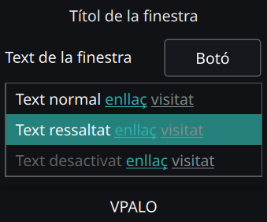
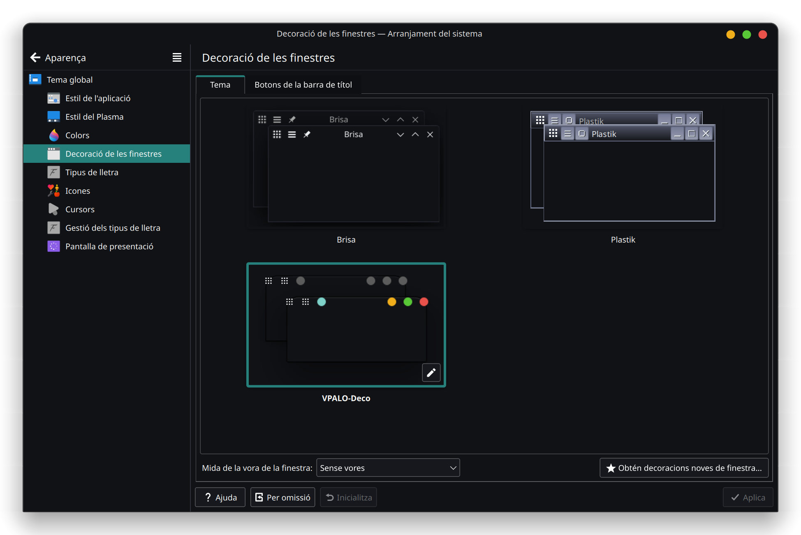

<h1 align="center">VPALO's GNU/Linux Customizations</h1>

## Screenshots (Preview)

---

## Installation
### Color Scheme (`VPALO.colors` file)
1. Move the `VPALO.colors` file to `/usr/share/color-schemes` directory.
2. Once you moved the file, go open `Colors` to apply `VPALO` (*Color Scheme*).

---

### Plasma Window Decoration (`VPALO-Deco` folder)
1. Move the `VPALO-Deco` folder to `/usr/share/aurorae/themes/` directory.
2. Once you moved the directory, go open  `Window Decorations` to apply `VPALO-Deco` (*Plasma Window Decoration*).

---

### Neofetch Configuration (`config.conf` file)
1. Replace the `config.conf` file in `/home/YOUR-USER/.config/neofetch/` directory.
2. Type `neofetch` to test it.

---

#### Notes
- 🟡 Please, use any [Nerd Font](https://www.nerdfonts.com/font-downloads) in order to make the icons visible in terminal (I'm using [`MesloLG Nerd Font`](https://github.com/ryanoasis/nerd-fonts/releases/download/v3.0.2/Meslo.zip)).
- 🟡 If something is missing or wrong, feel free to check the [KDE Plasma Documentation](https://develop.kde.org/docs/plasma/) yourself.

#### Acknowledgements
- 🟢 **`VPALO-Deco`** (*Plasma Window Decoration*) is based on [`vinceliuice`](https://github.com/vinceliuice/MacSonoma-kde)'s work. **Thank you** for your time and effort.
