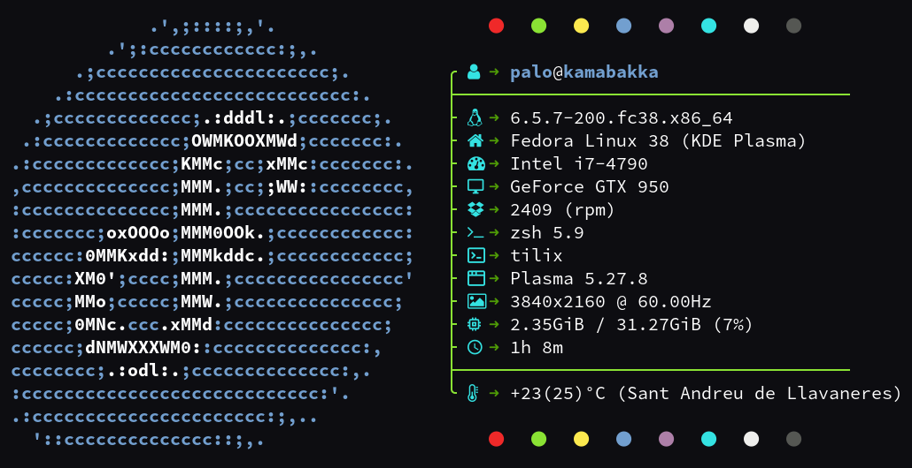

<h1 align="center">⚡ VPΛLΘ • GNU/Linux🐧 Customizations⚙️</h1>

---

## Table of Contents

- [🚧 Installation]()

## 🚧 Installation
  
<h3 align="center">Color Scheme</h3>

1️⃣. Move the `VPALO.colors` file to `/usr/share/color-schemes` directory.

2️⃣. Once you moved the file, go open `Colors` to apply `VPALO` (*Color Scheme*).

---

<h3 align="center">Plasma Window Decoration</h3>

1️⃣. Move the `VPALO-Deco` folder to `/usr/share/aurorae/themes/` directory.

2️⃣. Once you moved the directory, go open  `Window Decorations` to apply `VPALO-Deco` (*Plasma Window Decoration*).

---

<h3 align="center">Neofetch Configuration</h3>

- ⚠️ For the correct neofetch configuration usage, please use any [`Nerd Font`](https://www.nerdfonts.com/font-downloads) in order to make the icons visible in terminal (for instance, I am using '[`MesloLG Nerd Font`](https://github.com/ryanoasis/nerd-fonts/releases/download/v3.0.2/Meslo.zip)').
- 🤓 There is no need to backup your original `config.conf` file because if you lose that file, it will be regenerated when you type and run `neofetch` in your terminal.

1️⃣. Replace the `config.conf` file in `~/.config/neofetch/` directory.

2️⃣. Execute `neofetch` to test it and check the results.

---

## 🏆 Acknowledgements

- **`VPALO-Deco`** (*Plasma Window Decoration*): My work is based on [`vinceliuice`](https://github.com/vinceliuice/MacSonoma-kde)'s work. **Thank you** for your time and effort.

---

## 📝 Final notes
- If something is missing or wrong, feel free to check the [`KDE Plasma Documentation`](https://develop.kde.org/docs/plasma/) yourself.
